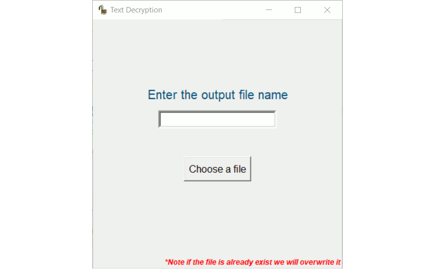
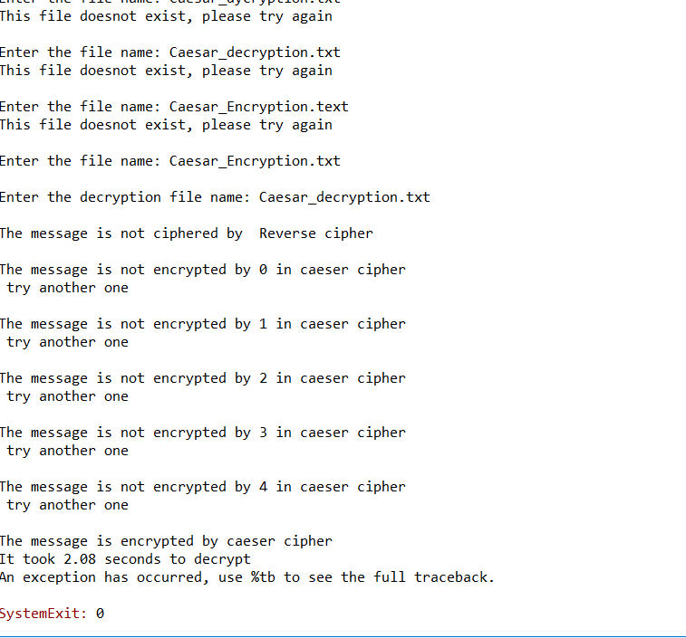
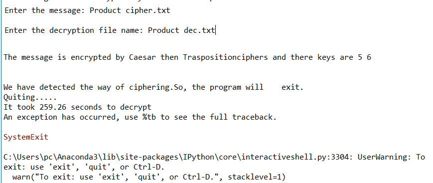
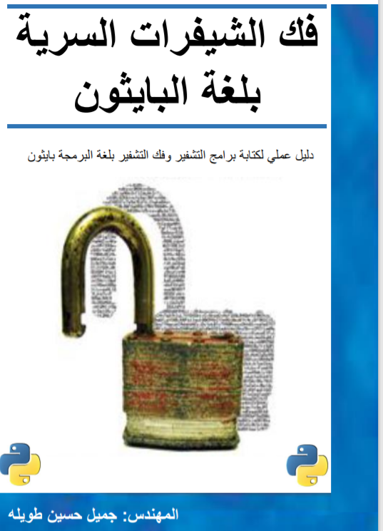

## Introduction
Used to decrypt any English word encrypted by Reverse, Caesar, Transposition cipher, or product cipher(Caesar and Transposition cipher).
We can enter files or text and the program will detect it.

We will speak about using [GUI](#GUI) and talk about [Code](#Code)

## GUI

## Code
## Index    
    1- We will start with [How to run the progam](#How to run program)
    2- Then move to [How does it work](#How does it work?) to see the methodology of making the program
    3- Transfering to [Resources](#Resources) that helps me make this program.
    4- Then will end with [Documentation](#Documentation) if you want to use it.

## How to run program 
Click on ***'CipherDecryption.py'*** or navigate to the directory using cd [directory] then ***'python CipherDecryption.py'*** 

<prev >
<code >
cd "Cipher by many type"
python CipherDecryption.py
</code>
</prev>

Enter the file or type the text you want to decrypt enter the output file, get the plaintext.

## How does it work?

The program will check if it is ciphered by reverse then Caesar then Transposition then product which is substitution(Caesar) and Transposition.
It will check the cipher is encrypted by each one or not by searching for the word on the file whether it in the dictionary or then check what is the percentage of all word and check the unusual letter or symbol which is not in the English.

## Resources
[Symmetric Cryptography](https://www.coursera.org/learn/symmetric-crypto)
Hacking Secret Ciphers with Python by Jameel Huseen Tawelh
فك الشيفرات السرية بلغة البايثون بواسطة جميل حسين طويلة

## Documentation
    * [CipherDecryption](#CipherDecryption)
    * [CaesarCipher](#CaesarCipher)
    * [TranspositionCipherDecryption](#TranspositionCipherDecryption)
    
    ### CipherDecryption
        ***main(message, outputFile *optional*)***
            *Start the program and get the decrypted message*
            * message str
                - encrypted message or the file that contain the decrypted message
            
            * outputFile str default ''
                - The file that we will write the decrypted message in it.

        ***caesar(key, message, word *Optional*, letter *Optional*)***   
            * Check [CaesarCipher](#CaesarCipher)

        ***mainTrans(key, message, word *Optional*, letter *Optional*)***
            * Check [main in TranspositionCipherDecryption](#TranspositionCipherDecryption)
            The function that decrypts the Transposition encrypted message.

        ***write_in_file(message)***
            *Used to write the decrypted message in a file*
            * **message** str
                - The decrypted message that we want to wnat to insert in a file

        *** isEnglish(message , wordPercentage *Optional* , letterPercentage *Optional*) ***
            *Used to check whether the message is English or not*
            - **message** str
                * The message that we want to check whether it is English or not.

            - **wordPercentage** float default 20
                * The percentage of English words in the message *0<word<100*
            
            - **letterPercentage** float default 85
                * The percentage of English letters in the message *0<letter<100*

    ### CaesarCipher
        ***caesar(key, message, word *Optional*, letter *Optional*)***  
            Return a tuple (True,the decrypted message) if encrypted by this key or (False, message that we get when using this key)

            * **key** int
                - The key that the message ciphered with
            * **message** str
                - The message that we need to decrypt
            * **word** int default 1 
                - Percentage of word to be used in isEnglish function to detect whether it is encrypted by Caesar and this key or not.
            * **letter** int default 80
                - Percentage of letter to be used in isEnglish function to detect whether it is encrypted by Caesar and this key or    not.

    ### TranspositionCipherDecryption
        ***main(key, message, word *Optional*, letter *Optional*)***
            The function that decrypts the Transposition encrypted message.
            Return a tuple (True,the decrypted message) if encrypted by this key or (False, message that we get when using this key)

            * **key** int
                - The key that the message ciphered with
            * **message** str
                - The message that we need to decrypt
             * **word** int default 1 
                - Percentage of word to be used in isEnglish function to detect whether it is encrypted by Caesar and this key or not.
            * **letter** int default 80
                - Percentage of letter to be used in isEnglish function to detect whether it is encrypted by Caesar and this key or not.

        ***decrypt_message(key,message)***
            Return decrypted message by this key

            * **key** int
                - The key that the message ciphered with
            * **message** str
                - The message that we need to decrypt

___The program idea taken from (python_code_uncoder)___
